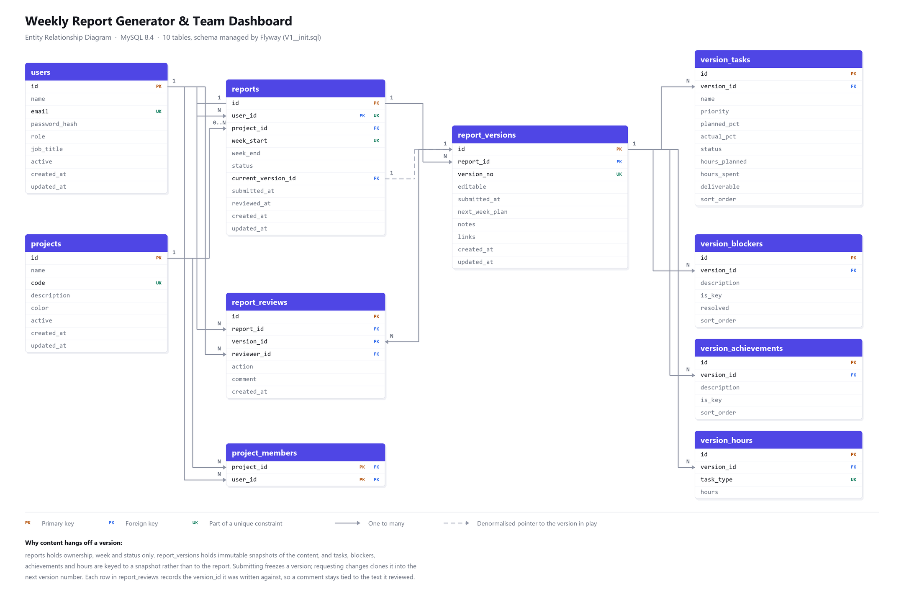

# Weekly Report Generator & Team Dashboard

An internal tool for weekly work reporting. Team members file a structured
report each week; managers review it, approve it or send it back with a comment,
and track the whole team from a dashboard.

- **Backend** — Java 21, Spring Boot 4.1, Spring Security, JPA/Hibernate, Flyway, MySQL 8.4
- **Frontend** — Next.js (App Router), TypeScript, Tailwind CSS, TanStack Query, Recharts
- **Database** — MySQL 8.4, run from Docker Compose

---

## Quick start

Three commands, assuming Docker Desktop is running.

```bash
# 1. database + backend  (Spring Boot starts the MySQL container itself)
cd backend
./mvnw spring-boot:run          # Windows: .\mvnw.cmd spring-boot:run

# 2. frontend, in a second terminal
cd frontend
npm install
npm run dev
```

Then open <http://localhost:3000>.

On first run the backend creates the schema, seeds a demo dataset, and prints
`Demo seed complete` in the log.

### Demo accounts

| Role | Email | Password |
| --- | --- | --- |
| Manager | `manager@sisenco.local` | `Manager@12345` |
| Member | `ravi@sisenco.local` | `password123` |
| Member | `thara@sisenco.local` | `password123` |
| Member | `dinuka@sisenco.local` | `password123` |
| Member | `amaya@sisenco.local` | `password123` |
| Member | `kasun@sisenco.local` | `password123` |

The seeded data is deliberately uneven — six weeks of reports, some approved,
one awaiting review, one sent back for correction, one still a draft, and two
members who have not started the current week. Without that spread every
compliance figure on the dashboard would read 100% and demonstrate nothing.

---

## Prerequisites

| Tool | Version | Notes |
| --- | --- | --- |
| JDK | 21 | `java -version` |
| Node.js | 20+ | `node -v` |
| Docker Desktop | any recent | must be **running** before starting the backend |

Maven is **not** required — the repository ships the Maven wrapper (`mvnw`).

---

## 1. Running the database

The backend starts MySQL for you. `spring-boot-docker-compose` finds
`backend/compose.yaml` on startup, launches the container and wires the
datasource to it. Nothing else to do.

To manage it by hand:

```bash
cd backend
docker compose up -d      # start
docker compose ps         # status
docker compose logs -f    # follow the log
docker compose stop       # stop, keep data
```

**The container publishes MySQL on host port `3307`, not 3306.** A locally
installed MySQL service usually holds 3306, so this keeps the project
self-contained and lets both run at once.

Connect a GUI client with:

```
Host 127.0.0.1   Port 3307   Database weeklyreport
User weeklyreport   Password weeklyreport      (or root / root)
```

The container keeps its data in a named Docker volume, so it survives
restarts. `docker compose down -v` deletes that volume and every seeded
report with it — the next start rebuilds the schema and reseeds from scratch.

### Schema

Flyway owns the schema; migrations live in
`backend/src/main/resources/db/migration`. Hibernate runs with
`ddl-auto=validate`, so an entity that no longer matches the migrations fails
at startup rather than at runtime.

Check which migrations have run:

```sql
SELECT * FROM flyway_schema_history;
```

---

## 2. Running the backend

```bash
cd backend
./mvnw spring-boot:run          # Windows: .\mvnw.cmd spring-boot:run
```

The API listens on <http://localhost:8080>; health is at
`/actuator/health`.

Build a jar instead:

```bash
./mvnw clean package
java -jar target/weeklyreport-0.0.1-SNAPSHOT.jar
```

### Configuration

Everything in `application.yaml` can be overridden by environment variable.

| Variable | Default | Purpose |
| --- | --- | --- |
| `SPRING_DATASOURCE_URL` | `jdbc:mysql://localhost:3307/weeklyreport` | Database |
| `SPRING_DATASOURCE_USERNAME` | `weeklyreport` | |
| `SPRING_DATASOURCE_PASSWORD` | `weeklyreport` | |
| `JWT_SECRET` | dev-only value | **Change when deploying.** Minimum 32 bytes |
| `JWT_EXPIRATION_MINUTES` | `240` | Session lifetime |
| `JWT_SECURE_COOKIE` | `false` | Set `true` behind HTTPS |
| `JWT_SAME_SITE` | `Lax` | `None` if the frontend is on another domain |
| `CORS_ALLOWED_ORIGINS` | `http://localhost:3000` | Comma-separated |
| `SEED_ENABLED` | `true` | Set `false` to skip the demo dataset |
| `BOOTSTRAP_MANAGER_EMAIL` | `manager@sisenco.local` | First manager account |
| `BOOTSTRAP_MANAGER_PASSWORD` | `Manager@12345` | **Change when deploying** |

---

## 3. Running the frontend

```bash
cd frontend
npm install
npm run dev
```

Runs on <http://localhost:3000>.

The frontend calls the API through a Next.js rewrite, so the browser sees a
single origin. That keeps the session cookie first-party and means no CORS
preflight in normal use. Point it elsewhere with `BACKEND_URL` in
`frontend/.env.local`:

```
BACKEND_URL=http://localhost:8080
```

> **`BACKEND_URL` is read when the rewrite is compiled, not when the server
> boots.** `npm run dev` picks it up on restart, but a production build bakes
> the destination into the route manifest — so set it *before* `npm run build`,
> not before `npm run start`. Changing it afterwards requires a rebuild.

---

## Testing

```bash
cd backend
./mvnw test
```

Integration tests bring up a throwaway MySQL with Testcontainers, so Docker
must be running.

There are also three PowerShell smoke scripts that exercise the running API
end to end. They are development aids rather than a substitute for the test
suite, but they cover the workflow in more depth than a unit test can:

```powershell
cd backend
.\scripts\smoke-auth.ps1          # 12 checks  - sessions and login rules
.\scripts\smoke-workflow.ps1      # 48 checks  - the full review cycle
.\scripts\smoke-dashboard.ps1     # 40 checks  - metrics, charts, access control
```

A Postman collection for the auth endpoints is in
`backend/postman/`.

---

## Architecture

```
weekly-report-dashboard/
├── backend/
│   └── src/main/java/com/sisenco/weeklyreport/
│       ├── config/       security, CORS, bootstrap manager, demo seed
│       ├── domain/       JPA entities and enums
│       ├── dto/
│       │   ├── request/  inbound payloads, validated
│       │   └── response/ outbound shapes — entities are never serialised
│       ├── exception/    typed failures mapped to RFC 9457 problem responses
│       ├── repository/   Spring Data interfaces and query specifications
│       ├── security/     JWT issuing, the auth filter, the principal
│       ├── service/      interfaces — the business rules live behind these
│       │   └── impl/     implementations
│       └── web/          REST controllers
└── frontend/
    └── src/
        ├── app/          App Router pages
        ├── components/   reusable UI, report widgets, charts
        └── lib/          API client, query hooks, shared types
```

### Entity relationship diagram



Rendered by `docs/er-diagram.py`, which draws the boxes and routes the
connectors by hand from the schema in `V1__init.sql`. It is not generated from
a live database, so **a schema change means editing both** — the migration and
that script.

### Report versioning

A report is not one mutable row. `reports` holds ownership, the week and the
status; `report_versions` holds immutable snapshots of the content, and the
tasks, blockers, achievements and hours hang off a **version** rather than the
report.

Exactly one version at a time is editable:

1. Creating a report creates version 1, editable.
2. Submitting freezes it — `editable = false`, `submitted_at` set.
3. Requesting changes records the comment against the version just reviewed,
   then clones that version into `version_no + 1` and marks the clone editable.
4. The member edits the clone and resubmits, freezing that one in turn.

Frozen versions are never written to again. That is what lets a manager see
every past version of a week alongside the one under review, and lets each
comment stay attached to the text it was actually written about.

### Access control

Two layers, and both are needed:

- **Role checks** — URL matchers in `SecurityConfig` plus `@PreAuthorize`,
  answering "may this kind of user call this endpoint at all?"
- **Ownership checks** — in the service layer, answering "is this particular
  row yours?". A URL pattern cannot express that, so `GET /api/reports/{id}`
  is role-checked at the filter chain and owner-checked in the service.

Notable consequences:

- A draft is visible only to its author. Managers are excluded from other
  people's drafts at the **query** level, so no filter combination can surface
  one.
- A report you may not see returns **404, not 403** — a 403 would confirm the
  id exists.
- A manager has **no endpoint** that writes report content. The absence of a
  write path is the enforcement, rather than a check somebody could forget.
- A manager cannot review their own report.

### Sessions

Authentication is a signed JWT in an **httpOnly** cookie. Page scripts cannot
read it, so an XSS bug cannot walk off with a live session the way it could
with a token in `localStorage`. The filter re-reads the user on each request,
which costs one primary-key lookup and buys immediate revocation: deactivating
an account locks it out at once rather than whenever the token expires.

CSRF protection is currently disabled, which is only sound because the cookie
is `SameSite=Lax` and the browser reaches the API through a same-origin
rewrite. Deploying the frontend on a genuinely different site would need
`SameSite=None` and therefore real CSRF tokens.

---

## API overview

All paths are prefixed `/api`. Every endpoint except register, login, logout
and the health check requires a session.

### Auth

| Method | Path | Who |
| --- | --- | --- |
| `POST` | `/auth/register` | anyone — always creates a MEMBER |
| `POST` | `/auth/login` | anyone |
| `POST` | `/auth/logout` | anyone |
| `GET` | `/auth/me` | authenticated |

### Reports — a member's own

| Method | Path |
| --- | --- |
| `GET` | `/reports/mine?status=&projectId=&from=&to=&page=&size=` |
| `POST` | `/reports` |
| `GET` | `/reports/{id}` |
| `PUT` | `/reports/{id}` |
| `POST` | `/reports/{id}/submit` |
| `GET` | `/reports/{id}/versions` |

`weekStart` must be a **Monday**; anything else is rejected, so one week can
never be filed twice under two dates.

### Reports — manager

| Method | Path |
| --- | --- |
| `GET` | `/manager/reports?userId=&status=&projectId=&weekStart=&from=&to=` |
| `POST` | `/manager/reports/{id}/review` |

### Dashboard — manager

| Method | Path |
| --- | --- |
| `GET` | `/manager/dashboard/summary?weekStart=` |
| `GET` | `/manager/dashboard/submissions?weekStart=` |
| `GET` | `/manager/dashboard/tasks-trend?from=&to=&userId=` |
| `GET` | `/manager/dashboard/workload-by-project?from=&to=` |
| `GET` | `/manager/dashboard/time-by-task-type?from=&to=` |
| `GET` | `/manager/dashboard/status-by-member?from=&to=` |
| `GET` | `/manager/dashboard/activity?page=&size=` |
| `GET` | `/manager/dashboard/section?section=BLOCKERS\|ACHIEVEMENTS&weekStart=` |
| `GET` | `/manager/members/{userId}/stats` |

Date parameters are optional. No `weekStart` means the current week; no range
means the last eight weeks. Any day of a week is snapped to its Monday.

### Projects and users

| Method | Path | Who |
| --- | --- | --- |
| `GET` | `/projects?activeOnly=` | authenticated |
| `POST` `PUT` `DELETE` | `/projects`, `/projects/{id}` | manager |
| `PUT` | `/projects/{id}/members` | manager |
| `GET` `POST` | `/users?role=&active=&search=` | manager |
| `PATCH` | `/users/{id}/role`, `/users/{id}/status` | manager |
| `DELETE` | `/users/{id}` | manager |

Assigning members to a project is optional. A project with nobody assigned is
available to everyone; the assignment is a hint about who works on what, not a
permission boundary — reports are never restricted by project membership.

Deleting a user deactivates them rather than dropping the row, so their report
history survives. Deleting a project is refused once any report references it;
archive it instead.

### Errors

Failures come back as RFC 9457 problem documents:

```json
{
  "status": 400,
  "detail": "Request validation failed",
  "errors": { "email": "Must be a valid email" }
}
```

---

## Roles

Two roles, matching the brief's "Team Member" and "Manager / Admin":

- **MEMBER** — creates, edits and submits their own reports, and sees only those.
- **MANAGER** — reviews every member's report, and manages users and projects.
  Cannot edit anyone else's report content.

The brief allows role assignment "by an admin, or at signup", and this
application does both: the registration form asks which role you are joining
as, and a manager can change anyone's role afterwards.

That choice has a consequence worth stating plainly: **anyone who can reach the
signup page can select MANAGER and read every team member's reports.** That is
fine for an internal tool behind a company network, and fine for this
assignment, but a public deployment would want an invite code or an approval
step in front of it. Omitting the field from the request defaults to MEMBER,
the narrower of the two.

A bootstrap manager is still created at startup when no active manager exists,
so a fresh database is administrable before anyone has registered.

---

## Troubleshooting

| Symptom | Cause |
| --- | --- |
| `Communications link failure` on startup | Docker Desktop not running, or the container is still starting |
| `Port 8080 was already in use` | An earlier backend is still running |
| `ports are not available: 3307` | Something else holds 3307; change the mapping in `compose.yaml` and `SPRING_DATASOURCE_URL` |
| Frontend calls return 401 after login | Cookies blocked — use `http://localhost:3000`, not `127.0.0.1` |
| Dashboard is empty | Seed skipped because reports already exist. `docker compose down -v` and restart to rebuild |
